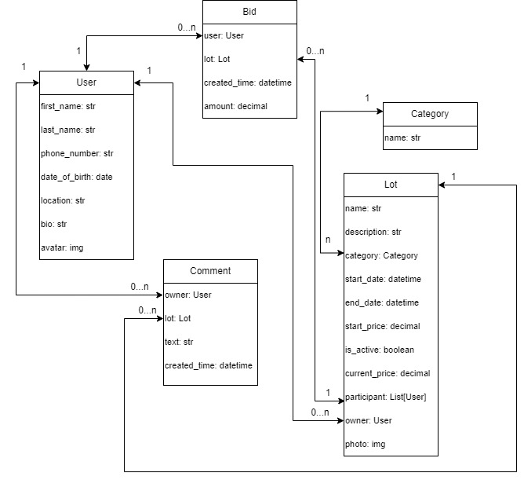

# Auction
> Student project 

This is a custom Auction service that provides you to create lots, make comments and set bids

> future link
## Getting started

Firstly, clone repository  
Then, create .venv environment  
Install requirments.txt by the command below  


```shell
git clone https://github.com/dimak20/auction.git
cd auction
python -m venv env
source env/bin/activate  # For Windows: `env\Scripts\activate`
pip install -r requirements.txt
```

You need to make migrations
```shell
python manage.py makemigrations
python manage.py migrate
```

And finally, create superuser and start server

```shell
python manage.py createsuperuser
python manage.py runserver # http://127.0.0.1:8000/
```


### Project configuration

Your project need to have this structure


```plaintext
Project
├── Auction
│   ├── __init__.py
│   ├── models.py
│   └── views.py
│   ├──celery.py
│   ├── settings.py
│   └── urls.py
│
├── manage.py
│   
├── media
│   
├── static
│
├── tendering
│   ├── __init__.py
│   └── admin.py
│   ├── apps.py
└   ├── forms.py
│   ├── models.py
└   ├── tasks.py
│   ├── urls.py
│   └── views.py
└── requirements.txt
```


## Features

* Creation users
* Creation lots with set price and uploading photo
* Makin comments and bids under the lot detail
* Customising your profile by photo, bio and other information
* Tracking statistics on the home page

